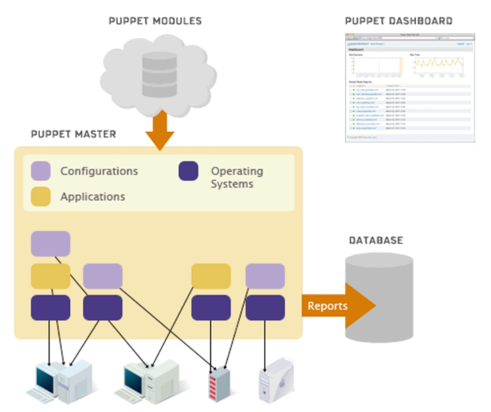

# 代码部署

## 最简单的部署

```
git clone git@github.com:i5ting/shop-api.git
git clone git@github.com:i5ting/shop-admin.git
git clone git@github.com:i5ting/shop-h5.git
```


## ftp上传

前提是在服务器上部署ftp服务器

推荐使用gulp和ftp部署

https://github.com/nodeonly/gulp-sftp


## 本地直接部署

```
$ pm2 deploy
```

## 批量部署

有个概念叫配置管理，如果机器非常多的时候，推荐使用

- https://puppet.com/
- https://docs.saltstack.com/en/latest/

puppet是一种Linux、Unix、windows平台的集中配置管理系统；
使用自有的puppet描述语言，可管理配置文件、用户、cron任务、软件包、系统服务等，puppet把这些系统实体称之为资源；

puppet的设计目标是简化对这些资源的管理以及妥善处理资源间的依赖关系


