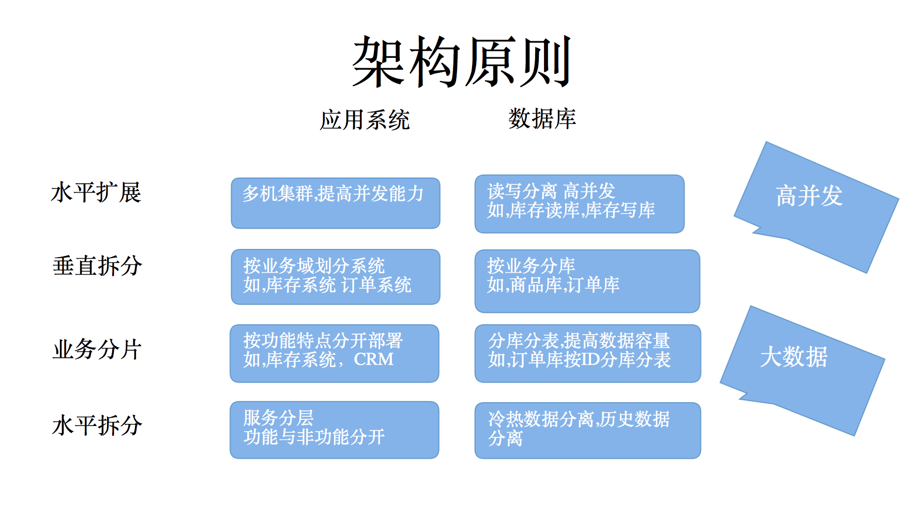
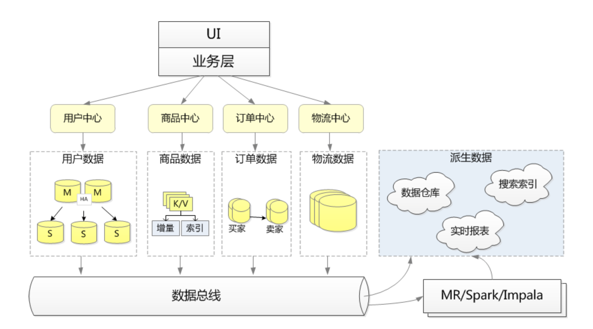
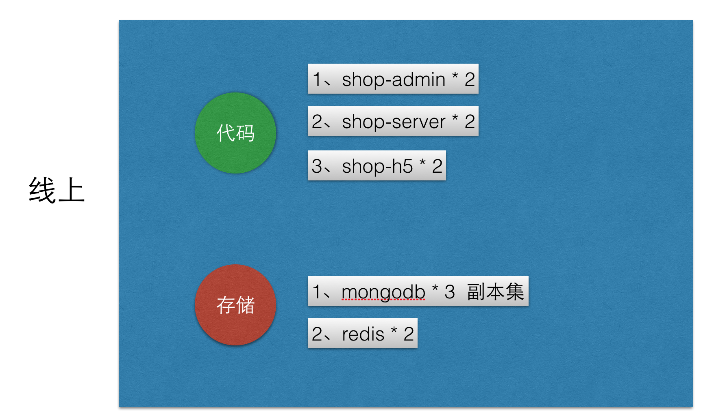

# Overview

## 原则

## 示例

## 部署

代码共3份

- api接口 [shop-api](https://github.com/i5ting/shop-api)
- 后台管理 [shop-admin](https://github.com/i5ting/shop-admin)
- h5展示  [shop-h5](https://github.com/i5ting/shop-h5)

最小化做法

- 代码3个repo共用1台服务器 * n（n >= 1）
- mongo 1 

问题

- 雪崩
- 单点
