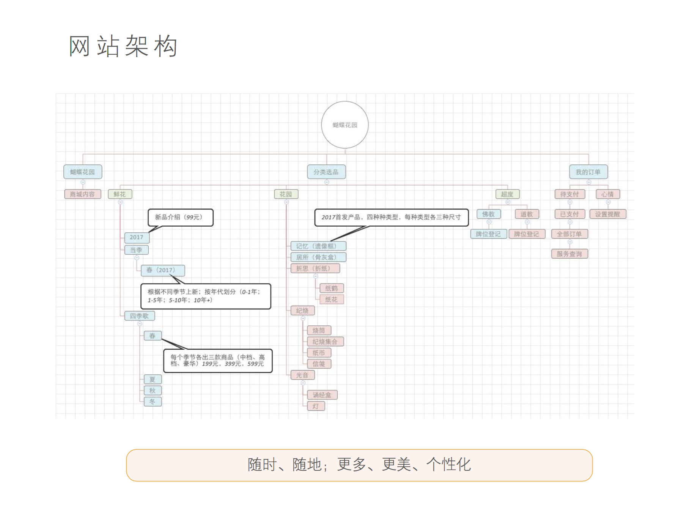
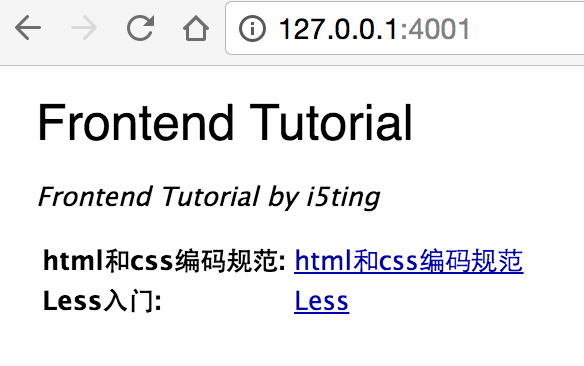

# 前端



## v1：纯静态

### 技术栈

- http://light7.cn/
- http://zeptojs.com/
- http://www.swiper.com.cn/

### 参考

- http://www.smartisan.com/cn/#/home

## v2：预处理 + 模板

https://github.com/sintaxi/harp

安装

```
$ npm i -g harp
$ mkdir src
$ cd src
$ harp init
$ harp server
```

### jade 

- 抽取布局文件
- 复制资源文件到src下
- 分别实现html为jade

推荐使用hade工具

> npm i -g hade

启动

> hade

- https://github.com/i5ting/hade

### less

把index.css改成index.less

- http://fishsticss.com/


关于less学习

> [sudo] npm install -g ft2
> ft



### 发布

在package.json里

```
  "scripts": {
    "start": "harp server src",
    "test": "echo \"Error: no test specified\" && exit 1",
    "dist": "harp compile src dist"
  },
```

即

```
  "scripts": {
    "dist": "harp compile src dist"
  },
```

生成html，然后放到http服务器里即可

## v3：render

典型的ctx.render{模板 + 数据} =>  HTML


## moa2-frontend