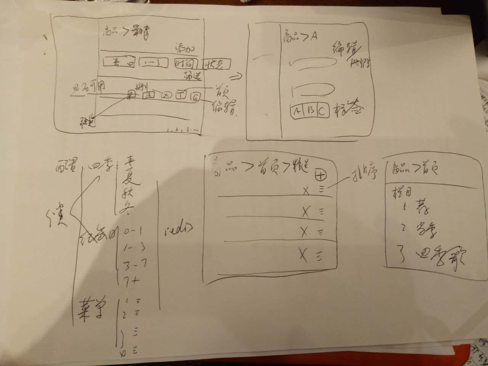

# MVP最小可用原型


## 功能

- 首页
  - 分类菜单
- 分类列表
- 商品详情
- 加入购物车，结算（此步骤略过，不影响业务），生成订单
- 我的页面

## 举例：首页

- res.render(‘模板’，{数据})
  - 模拟数据，先看效果
  - 如果效果没问题，就把模拟数据变成真实数据（此时操作数据库）
- 变化的，前后端分离，抽出api层
  - 之前如何操作数据库都有了，返回json，又有何难
  - res.api
  - 利用nginx等进行分离
- 静态化，不变的页面
  - 减少数据库的访问
  - 可以考虑结合cdn + 子域名


区分页面的变与不变

- 如果货品详情可能变就写成api
- 比如首页，很长时间都不会变，为了更快的访问，生成静态html

### 模拟数据

首页拆分

- 置顶轮播，点击进入详情
- 头图推荐：比如超度，点击进入分类列表
- 当季
- 四季歌
  - 春，点击进入分类列表
  - 夏，点击进入分类列表
  - 秋，点击进入分类列表
  - 冬，点击进入分类列表
- 花园商品，点击进入花园分类列表
- 最下面：网站说明

index.json

```
{
  slides: [
    { 
      id: 1,
      title: 'xxx',
      img: '/images/1.png',
    },
    { 
      id: 2,
      title: 'yyy',
      img: '/images/1.png',
    }
  ],
  suggestion: [
    { 
      id: 1,
      title: '超度',
      img: '/images/1.png',
    }
  ],
  flower_current: [],
  flower: [
    {
      cid: 1,
      title: '春'，
      items: [
      
      ]
    },
    {
      cid: 2,
      title: '夏'，
      items: [
      
      ]
    }
  
  ]， 
  gardon: [
    {
      cid: 1,
      title: '春'，
      items: [
      
      ]
    },
    {
      cid: 2,
      title: '夏'，
      items: [
      
      ]
    }
  
  ]
}
```

### 移动端先显示

```
let data = require('../data/index.json')

res.render('mobile/index', data)
```

实现移动端首页效果


实现从数据库里查询真实的数据。目前我们知道我们要的数据是`../data/index.json`这样的数据，那么我们就从模型里获取这些数据不就ok了么？

- 头图列表
- 推荐列表
- 首页显示的flower商品列表
- 首页显示的gardon商品列表

回想一下商品模型

推导出商品模型

- 商品名称 
- 销量（分类列表-排序）
- 价格￥15.00（分类列表-排序）
- 头图（数组）
- 所属菜单（春）
- 所属分类（年份：0~1年）
- 备注（* 7 天无理由退货，15 天免费换货，满 150 元免运费。）
- 创建时间
- 更新时间
- 是否显示
- 是否首页
- 是否头图
- 是否推荐

那么如何处理呢？

### 批量造数据

还记migrate写法么？其实就是纯db操作

- 连接数据库
- 定义模型
- 实例化模型
- crud

```
 #!/usr/bin/env node

'use strict'

var path = require('path')

global.log = console.log
// 完成发货单，并生成对应账单
global.$config = require('../config')
require('../db')

var User = require('../app/models/user')

// console.log(User)

User.find({}, function (err, docs) {
  if (err) {
    console.log(err)
  }
  console.dir('docs')
  console.dir(docs)
  // process.exit()
})

```

如果我们把它变成

```
User.create({username: 'stuq',password: '000000')
```

是不是批量创建数据库就非常简单了。

结合上面的需求

- 头图列表
- 推荐列表
- 首页显示的flower商品列表
- 首页显示的gardon商品列表

想想如何写一个脚本就能完成所有数据的构造？

### 数据处理

有了上面造的数据，是不是就可以查询了？

最简单的办法，查询出所有商品，然后遍历即可取出结果集，但一般不会这么做，如果商品像锤子商城数量较少是可行的，如果数量非常大，一定会有性能问题的。

很对时候，多次数据库查询都会比直接遍历要好

- 头图列表：find({是否头图: true and 是否显示:true})
- 推荐列表：find({是否推荐: true})
- 首页显示的flower商品列表：find({是否首页: true and 是否显示:true and category='flower'})
- 首页显示的gardon商品列表：find({是否首页: true and 是否显示:true and category='gardon'})

为了拼一个json，我竟然查了4次数据库？

不必惊讶，对于mongodb这样的nosql来讲，可能每次都是毫秒级别的，只要控制整个请求在200ms左右就可以，剩下的就是之前讲到的mongoose优化了（索引，执行计划，profile，sharding，replset等）。

如果要是换成mysql之类的rdbms，查询4次肯定是受不了的，那么怎么做呢？

- 加redis作为缓存，直接从缓存里去，如果缓存没有，从数据库去，然后放到缓存了，以后其他请求就可以直接从缓存取了，基本只有一次是比较慢的

### 静态化

前面讲了，拼json的几种方法，能不能拼一次，以后就直接访问静态页面呢？

之前是

> 首页->查询db->返回html

现在改成2步

- 后台，点击生成首页，发布到http server或cdn上
- 直接访问生成的http server或cdn上的静态页面

对比一下

- 多了一步生成页面
- 少了查询数据库的时间
- 效率更高


### 增加分类菜单

至此，所有的操作都是商品表

首先看一下，分类和商品之间的关系

商品模型

- 商品名称 
- 销量（分类列表-排序）
- 价格￥15.00（分类列表-排序）
- 头图（数组）
- 所属菜单（春）
- 所属分类（年份：0~1年）
- 备注（* 7 天无理由退货，15 天免费换货，满 150 元免运费。）
- 创建时间
- 更新时间
- 是否显示
- 是否首页
- 是否头图
- 是否推荐

> 一个商品属于1个分类，一个分类下面有多个商品

即

> 分类和商品是一对多关系

即分类id是商品表里的一个字段

- 在商品表，根据分类id查询，可以查询出很多商品

```
ProductSchema = new Schema({
    ...
    category_id: {
      type: Schema.ObjectId,
      ref: ‘Category’ 
    }
});

```

改造之前的代码

- 首页显示的flower商品列表：find({是否首页: true and 是否显示:true and category='flower'})
- 首页显示的gardon商品列表：find({是否首页: true and 是否显示:true and category='gardon'})

改成

- 首页显示的flower商品列表：find({是否首页: true and 是否显示:true and category_id='1'})
- 首页显示的gardon商品列表：find({是否首页: true and 是否显示:true and category_id='2'})

剩下的就是

- 重新造数据
- 修改查询（使用populate）即可

### 管理后台

- 商品管理
  - crud
  - 首页
  - 推荐
  - 轮播
- 订单管理
- 统计分析
  - 今日订单
  - 本年/月/周
  - 按照商品维度
  - 按照时间维度
  - 按照购买人地域维度
- 系统配置
- 用户管理

示意



## 不断重构模型

- 用户
- 商品
- 订单
- 分类

> 原则：先整体分析，避免少字段，反复重构问题，同时遵守kiss原则

如果对数据库不太熟的话，推荐学一下

- 三范式
- 笛卡尔积
- 关系：一对一，一对多，多对多
- SQL
- 建模工具：powerdesigner、erwin

说明：常见的关系型数据库来描述er模型比较多。我们用mongodb也是一样的，处理查询不太一样以外，其他都是一样的。


## Next

真实的项目也这样做么？

- 分析过程是一样的，推导出所有模型
- 根据需求，反复校验模型
- 建好模型，给出er图
- 给出文档：url，参数和返回值定义
- 分配任务，开发，遵循所谓的SMART原则
  - 任务必须是具体的（Specific） 
  - 任务必须是可以衡量的（Measurable）
  - 任务必须是可以达到的（Attainable）
  - 任务是实实在在的，可以证明和观察(Realistic)
  - 任务必须具有明确的截止期限（Time-bound）
  
这种是对于有经验的人，对于新手而言，很难做到尽善尽美的设计，所以需要大家理解这些设计是如何推导出来的，这是非常重要的。

狼叔说：

> 有了互联网，技巧性的东西不在是秘密，而很多经营的东西才是大家在未来的差异

希望大家多多思考，增长经验，下一节我们会讲具体实现。
