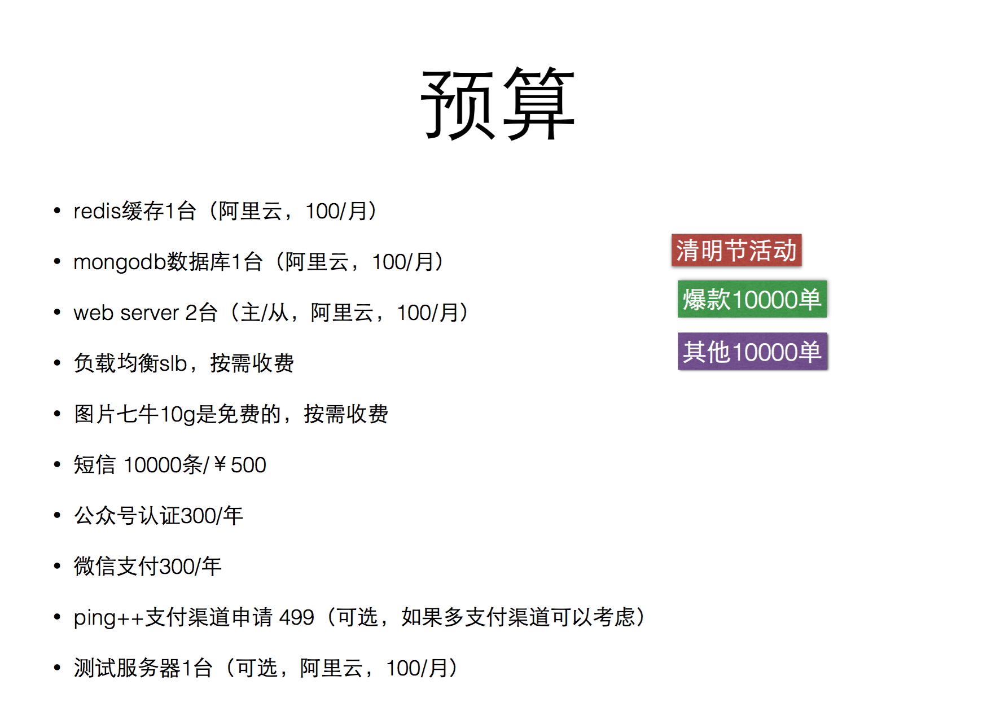

# 需求

## 微信菜单设计

- 首页
- 分类选购
  - 精选
  - 鲜花
  - 花园
  - 超度
- 我
  - 我的订单
  - 心情

## 分类菜单

默认分类菜单页面

步骤拆分

- 点击菜单按钮，弹出分类菜单
- 默认显示【精选】-》蝴蝶花2016
- 点击2016《里》进入具体详情，此时可以加入购物车
- 点击头部的【我的购物车】按钮，进入购物车
- 在购物车页面结算（含支付），生成订单
- 点击头部的【我的】按钮，进入个人中心，可以查看我的订单

选中【鲜花】分类，切换【四季歌】列表，点击【春】进入到分类列表页

说明

- 分类列表页有4个筛选，排序按钮
  - 年（筛选）
    - 0~1
    - 1~5
    - 5~10
    - 10+
  - 综合（排序）
  - 销量（排序）
  - 价格（排序）
  

详细分类

- 精选
  - 蝴蝶花
    - 2016《里》
- 鲜花
  - 四季歌
    - 春
    - 夏
    - 秋
    - 冬
- 花园
  - 居所
  - 记忆
  - 记烧
  - 光音
  - 折思
  - 其他
- 超度
  - 佛
  - 道

## 预算

